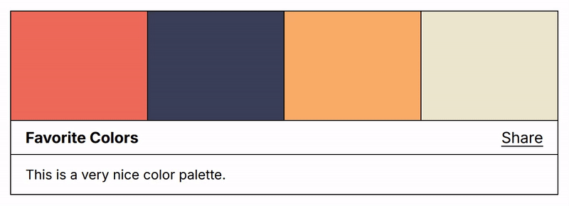

# Hue Grid Color Widget

**HueGrid** is a minimalist, brutalist-inspired color palette widget that displays colors and allows users to copy their hex values with a single click. The widget is designed to be easy to integrate and customize.



## Features
- Displays a color palette with the provided hex values.
- Copies the hex value of a color to the clipboard when clicked.
- Automatically adjusts text color for light backgrounds.
- Simple and clean design with CSS customization.
- Optional description for your palette.
- Shareable link to your palette.

## Usage

1. Download the `hgwidget.js` file and include it in your project:
    ```html
    <script src="hgwidget.js"></script>
    ```
2. Create a new `HueGrid` instance with your desired colors, palette name, and optional description:
    ```html
    <script>
        new HueGrid(["hexvalue1", "hexvalue2"], "Title", "Description");
    </script>
    ```

### Examples

Have a look on the [preview page](https://monolyt.github.io/HueGrid/) to see some examples of usage and see some functional widgets.

## Customization
You can easily customize the widget’s appearance by modifying the CSS variables in the script:
```css
:root {
    --hg-background-color: #ffffff;
    --hg-border-color: #000000;
    --hg-font-size: 16px;
    --hg-font-size-description: 14px;
    --hg-font-color: #000000;
    --hg-height: 150px;
    --hg-margin: 2rem auto;
    --hg-info-padding: 0 15px;
    --hg-info-height: 36px;
    --hg-hover-width: 80px;
    --hg-transition-duration: 0.1s;
    --hg-font-weight: bold;
    --hg-light-color: #000000;
    --hg-dark-color: #ffffff;
}
```
Adjust these variables to match your needs.

## License
This project is open-source and available under the [MIT License](LICENSE).
